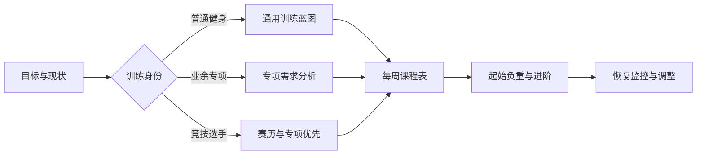

# Train Forge

> 为普通健身者与专项运动参与者生成可执行、可调整、重视安全边界的个性化训练计划。


Train Forge 是一个面向 ChatGPT 与 Codex 的训练规划 Skill。它不会只给出一堆动作清单，而是先识别你的目标、训练经验、可用时间、器械与恢复条件，再输出一份能真正排进日历的课程表。

无论目标是减脂增肌、增强体能、提高力量，还是为拳击、跑步、球类、攀岩等专项运动做体能支持，都可以从同一套动态问答开始。

## 它如何工作



每一轮问答都允许跳过。没有体检报告、穿戴设备、体脂数据或最大力量测试，也能得到保守的基础版本；未知信息会变成第一周的校准任务，而不是卡住你不让开始。

## 适合谁

| 你是谁 | Train Forge 会优先解决什么 |
| --- | --- |
| 想健康、减脂、增肌的普通训练者 | 把目标、时间和器械变成可持续的每周安排 |
| 刚开始力量训练或回归训练的人 | 从保守起始重量、RPE/RIR 和动作替代开始 |
| 有固定专项的业余爱好者 | 让力量与体能为专项技术服务，而不是挤占训练恢复 |
| 有赛事/赛季安排的运动员 | 围绕比赛、技术课、恢复和减量期安排体能负荷 |

## 你会得到什么

- 一页式个人档案：已知信息、未知信息、假设与计划精度
- 目标优先级与取舍说明
- 可重复执行的每周课程表
- 每次训练的时间卡片：热身、主训练、可选内容、停止条件
- 组数、次数、休息、RPE/RIR、配速或心率区间
- 起始重量的范围或校准办法，并明确标示总杠铃重量、单手哑铃重量、器械重量等单位
- 阶段计划、减量周、测试点和专项比赛前的调整
- 绿/黄/红恢复信号与替代方案

## 使用方式

在支持 Skills 的 ChatGPT 或 Codex 环境中，直接选择 **Train Forge**，或输入：

```text
$train-forge 我想减脂增肌，每周能练 4 天，只有健身房器械。帮我从问答开始制定计划。
```

也可以直接给出已知条件并要求立刻出初版：

```text
$train-forge 30 岁，175 cm，75 kg，久坐，想恢复力量训练并减脂；没有体检报告。先按现有信息给我一个保守的 3 天计划。
```

专项训练示例：

```text
$train-forge 我每周有 3 次拳击技术课，目标是改善 3 回合后的体能下降，同时增一点肌肉。请避免影响我的技术课恢复。
```

## 动态问答，而不是填表考试

Train Forge 会按信息价值逐步提问，而不是一次抛出几十个问题。

1. 先确认身份：普通健身、业余专项，还是竞技/职业训练。
2. 再确认第一目标：健康、外观、力量、体能、专项表现，或比赛表现。
3. 只追问会影响计划的条件：当前训练、每周时间、器械、疼痛或限制、恢复与专项安排。
4. 随时可以回答“暂不清楚”或“按现有信息出计划”。
5. 训练后用完成度、疲劳、疼痛和表现回顾来调整，而不是频繁推倒重来。

## 安全边界

Train Forge 是训练规划工具，不替代医生、康复师、持证教练或专项技术教练。

- 不会把体检报告当作诊断结论；没有报告同样可以从低风险版本开始。
- 出现胸痛、晕厥、神经症状、头部撞击后异常、尖锐或加重疼痛等情况时，会建议停止训练并寻求专业评估。
- 不建议通过频繁极限测试、惩罚性训练、脱水或极端节食来“快速见效”。

## 隐私说明

公开版本不包含任何个人训练档案、体检数据或既有课程表。使用时只提供你愿意分享的信息即可；可跳过的问题会以保守假设处理。

## 安装与发布

本仓库根目录是一个可移植的插件结构：`plugin.json` 位于根目录，Skill 位于 `skills/train-forge/`。

- 直接使用发行包：[下载 v1.0.0 ZIP](release/train-forge-plugin-v1.0.0.zip)
- 在 ChatGPT / Codex 的 Plugins 页面上传 ZIP 后，可在新对话中安装并调用。
- 如果你在团队或工作区内分发，可将该插件发布到工作区并控制可用角色。

## 项目结构

```text
.
├── plugin.json
├── skills/
│   └── train-forge/
│       ├── SKILL.md
│       ├── agents/openai.yaml
│       ├── assets/icon.svg
│       └── references/
│           ├── intake-flow.md
│           ├── intake-and-safety.md
│           ├── program-blueprints.md
│           ├── sport-demand-analysis.md
│           └── report-template.md
├── assets/train-forge-cover.png
└── release/train-forge-plugin-v1.0.0.zip
```

## 版本 1.0.0

首个可分享版本，包含：适应性问答、三类训练者分流、通用训练与专项体能规划、可跳过的健康信息收集、起始重量与强度说明、恢复监控及可视化课程报告规范。
